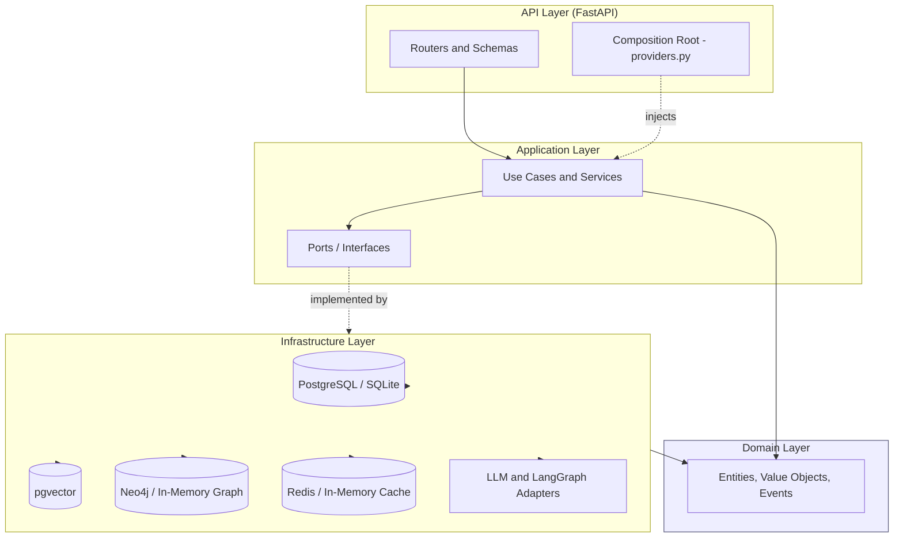
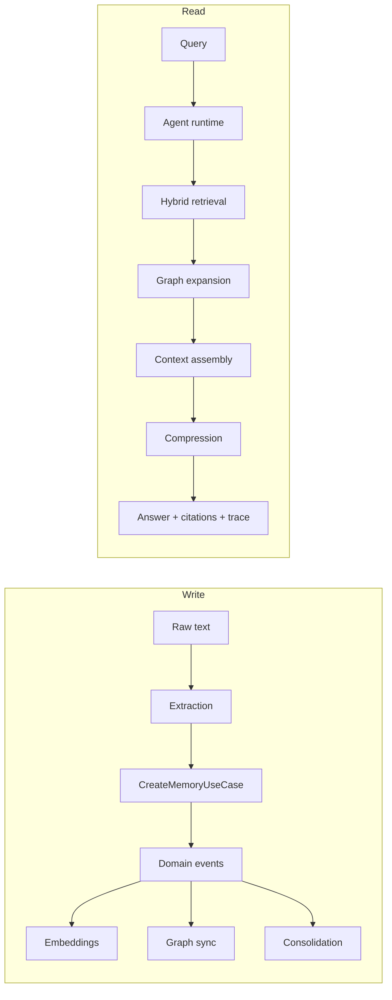

# MemoryArena

A production-grade memory backend for AI agents. MemoryArena ingests raw text,
distills it into structured and self-evolving memories, and serves them back
through hybrid retrieval, a knowledge graph, and token-budgeted context
assembly. It is built on Clean Architecture so that business rules remain
independent of frameworks, databases, and delivery mechanisms.

Version 1.0.0. Test status: 662 passed, 8 skipped, 0 failed.

---

## Overview

Large language models are stateless. Attaching a vector store to a prompt
provides recall but not memory: there is no notion of which facts matter, which
are stale, which contradict one another, or how they relate. MemoryArena treats
memory as a first-class domain with its own lifecycle and intelligence.

The system accepts conversations, events, and documents, and returns structured
memory of three kinds:

- Semantic memory — facts and knowledge, stored as text plus vector embeddings.
- Episodic memory — time-stamped events, stored relationally.
- Relational memory — entities and the typed edges that connect them, stored in
  a knowledge graph.

The pipeline is ingest, score, evolve, embed, retrieve, and assemble context. A
query-time agent runtime orchestrates that pipeline into an answer with
citations and an execution trace. The platform is designed to be useful and
fully testable with no external LLM in the loop: every external dependency sits
behind a port with an offline default implementation.

Memory architecture matters because an agent is only as good as the context it
is given. Naive retrieval returns the most similar chunks regardless of value,
freshness, or contradiction. MemoryArena ranks by a blend of semantic
similarity, lexical match, intrinsic memory value, and recency; expands results
across a relationship graph; detects conflicts; and compresses the result into a
strict token budget before any model sees it.

---

## Key Features

### Memory Management
- A `Memory` aggregate with a full lifecycle: create, reinforce, decay, promote,
  archive, restore, delete, and version rollback.
- A five-signal scoring model (importance, utility, frequency, recency,
  confidence) combined into a single normalized score.
- Immutable version snapshots for a complete audit trail.
- Soft deletion with tombstones; multi-tenant scoping by user.

### Retrieval
- Hybrid retrieval that fuses vector similarity, Okapi BM25 lexical matching,
  memory-intelligence value, and recency, then reranks behind a pluggable port.
- A configurable scoring formula with weights injected per environment.
- A vector-index seam (`scan` brute-force default; a pgvector ANN mode for
  PostgreSQL deployments).
- Knowledge-graph expansion that follows typed edges to surface related memories
  with provenance tags.

### Agent Workflows
- A query-time agent runtime that orchestrates retrieval, graph expansion,
  context assembly, optional LLM compression, and answer generation in a single
  guarded pass.
- Streaming responses over Server-Sent Events.
- LangGraph-based extraction, consolidation, and agent engines available as
  optional adapters; deterministic sequential engines are the offline default.
- Write-time consolidation that archives near-duplicates and records
  contradictions as durable graph edges.

### Observability
- Structured JSON logging with per-request correlation IDs.
- Request-scoped agent traces with monotonic per-stage timing.
- Memory-health metrics: growth, promotion and archive rates, graph density, and
  summary coverage.
- A counters-and-latency metrics sink exposed over an HTTP endpoint.
- A trace-recorder seam with no-op, in-memory, and optional LangSmith adapters.

### Security
- JWT authentication with registration, login, refresh, and logout.
- Password hashing with bcrypt.
- Authorization that scopes every request to its tenant.
- A refresh-token store behind a port.
- Feature-flagged: authentication and authorization can be disabled for local or
  demo use.

### Performance
- Cache-aside response caching for analytics and memory-health reads, with
  event-driven invalidation and a TTL safety net.
- Pluggable cache backends: no-op default, in-memory, and Redis.
- Rate limiting behind a port (no-op default, Redis-backed implementation).
- Concurrent vector and keyword retrieval stages.
- Background, off-request processing for embeddings, graph sync, consolidation,
  and relationship inference.

### Dashboard
- A Next.js dashboard with six pages for exploring memories, the graph,
  retrieval and context debug output, the agent, and summaries.

### Deployment
- A free-tier deployment profile: SQLite, in-memory graph, no Redis or Neo4j,
  and deterministic providers.
- A Render-ready Dockerfile and Blueprint, and a Vercel configuration.
- Optional schema bootstrap and idempotent demo seeding on startup.

---

## Architecture

MemoryArena follows Clean Architecture (Ports and Adapters). The single rule that
governs the codebase is the dependency rule: source dependencies point inward
only. Inner layers never import outer layers, and the domain imports nothing from
the project or from any third-party framework.

### Domain Layer (`backend/app/domain`)
Pure-Python enterprise rules. Entities (`Memory`, `MemoryScore`,
`MemoryRelation`, `MemoryVersion`, `MemorySummary`), value objects (enums for
memory type, status, and relation type), domain events, and domain exceptions.
No framework imports.

### Application Layer (`backend/app/application`)
Use cases, services, and the ports they depend on (repositories, unit of work,
event dispatcher, embedding provider, reranker, graph repository, token counter,
context compressor, LLM provider, workflow and agent engines, scheduler, cache
provider, metrics sink, rate limiter, token service). DTOs are plain dataclasses.
No HTTP and no SQL.

### Infrastructure Layer (`backend/app/infrastructure`, `backend/app/repositories`)
Concrete adapters implementing the ports: async SQLAlchemy models and mappers,
repository implementations, the unit of work, Alembic migrations, embedding
providers, the Neo4j and in-memory graph repositories, the Redis and in-memory
caches, the event dispatcher, the JWT token service, the observability recorders,
and the LLM and LangGraph integrations.

### API Layer (`backend/app/api`)
FastAPI routers, Pydantic schemas (the wire contract), middleware, and the
composition root (`api/v1/dependencies/providers.py`) where abstract ports are
bound to concrete adapters via FastAPI dependency injection.



Three model representations are kept deliberately separate: domain entities
(business truth), ORM models (database rows), and API schemas (the wire format).
Mappers and presenters translate between them so each can evolve independently.

---

## System Capabilities

### Memory ingestion
Raw text is submitted to `POST /api/v1/ingest`. An extraction workflow turns the
signal into structured memory candidates and routes them through the single
write path (`CreateMemoryUseCase`). The use case persists the memory, commits the
transaction, and only then dispatches domain events.

### Consolidation
On creation, a new memory is compared against the user's recent active corpus.
Near-duplicates are archived under a supersedes relationship, and contradictions
are recorded as durable graph edges. This runs off the request path through a
background job processor.

### Conflict resolution
A conflict detector flags negation contradictions when two memories share
significant terms but exactly one is negated. Conflicts are reported, not
silently resolved, and are preserved through context compression.

### Graph-aware retrieval
Hybrid retrieval results are expanded across the knowledge graph along an
edge-type allowlist, scoped by tenant and status. Edge derivation is bounded to
the most recent candidates and re-derived on each sync so stale edges are
removed.

### Context building
`ContextBuilderService` runs selection, consolidation, conflict detection, and
compression to produce a `ContextPackage`. Selection is promoted-first and
greedy under a token budget.

### Compression
A heuristic compressor is the offline default. An optional LLM compressor is
available behind the same port; any validation or provider failure falls back to
the heuristic path, so context generation can never fail or exceed the token
budget.

### Agent runtime
`POST /api/v1/query` and `POST /api/v1/query/stream` orchestrate the pipeline
into an answer with validated citations and an execution trace. The runtime is a
single guarded pass with limits on iterations, tool calls, tokens, and time.

### Summaries
Rolling per-scope summaries (project, goal, experience) are derived artifacts,
stored separately from source memories, upserted, and versioned on change.
Exposed read-only over the summaries endpoints.

### Maintenance workflows
Scheduled sweeps drive decay, archival, promotion, and summary refresh through
the same intelligence service the API uses. An in-process scheduler holds the
jobs; a production cron driver can fire them behind the same port. Automatic
relationship inference adds semantic edges that survive graph re-derivation.



---

## Technology Stack

### Backend
- FastAPI (HTTP delivery)
- SQLAlchemy 2.x (async ORM) and Alembic (migrations)
- SQLite and PostgreSQL (relational storage; cross-dialect via a custom vector type)
- pgvector (vector similarity on PostgreSQL)
- Neo4j (knowledge graph; an in-memory graph is the offline default)
- Redis (caching and rate limiting; both optional)
- Pydantic and Pydantic Settings (validation and configuration)
- PyJWT and bcrypt (authentication)
- LangGraph and LangChain (optional workflow and agent engines; installed via an
  extra and only required when the LangGraph engines are selected)

### Frontend
- Next.js 15 (App Router) and React 19
- TypeScript (strict)
- TanStack Query (server state)
- React Flow (`@xyflow/react`) with dagre (graph visualization)
- Tailwind CSS with shadcn/ui and Radix primitives

### Infrastructure
- Docker and Docker Compose (local orchestration of PostgreSQL, Neo4j, Redis, backend)
- Render (backend hosting)
- Vercel (frontend hosting)

---

## Project Structure

```
memory_project/
├── backend/
│   ├── app/
│   │   ├── main.py                 # App factory and lifespan (datastores, event handlers, seeding)
│   │   ├── api/v1/
│   │   │   ├── router.py           # Aggregates all v1 routers
│   │   │   ├── routes/             # health, memories, retrieval, context, graph,
│   │   │   │                       #   ingest, query, summaries, auth, observability
│   │   │   ├── dependencies/       # providers.py (composition root), ratelimit.py
│   │   │   └── middleware/
│   │   ├── application/            # Use cases, services, and ports (framework-free)
│   │   │   ├── dto/                # Plain-dataclass DTOs
│   │   │   ├── interfaces/         # Ports: repositories, uow, dispatcher, providers,
│   │   │   │                       #   reranker, graph, scheduler, cache, metrics, auth
│   │   │   ├── services/           # memory, intelligence, analytics, authorization, plus
│   │   │   │                       #   retrieval/, context/, graph/, agent/, consolidation/,
│   │   │   │                       #   maintenance/, observability/, auth/, ratelimit/, cache/
│   │   │   └── use_cases/
│   │   ├── core/                   # config, logging, exceptions
│   │   ├── domain/                 # Pure entities, value objects, events, exceptions
│   │   ├── infrastructure/         # Adapters: database/, embeddings/, graph/, cache/,
│   │   │                           #   events/, llm/, observability/, security/, auth/, ratelimit/, seed/
│   │   ├── repositories/           # Concrete repository implementations
│   │   └── schemas/                # Pydantic wire schemas
│   ├── alembic/versions/           # Migrations 0001 through 0006
│   ├── scripts/seed_demo.py        # Demo seeding CLI
│   ├── tests/                      # unit/, integration/, e2e/
│   ├── pyproject.toml
│   └── Dockerfile.render           # Free-tier image (binds $PORT)
├── frontend/                       # Next.js 15 dashboard
│   └── src/                        # app/, components/, hooks/, services/, providers/, lib/, types/
├── infrastructure/                 # docker/, k8s/, monitoring/, scripts/
├── docs/                           # architecture.md, project_state.md, adr/
├── docker-compose.yml
├── render.yaml                     # Render Blueprint
├── .env.example
├── .env.production.example
└── README.md
```

---

## API Overview

All endpoints are versioned under `/api/v1` and return a standardized envelope
of `success`, `data` or `error`, and `request_id`.

| Group | Endpoints | Purpose |
| --- | --- | --- |
| Health | `GET /health`, `GET /version` | Liveness and build information |
| Memories | `POST /memories`, `GET/PUT/DELETE /memories/{id}`, `POST /memories/search`, `GET /memories/user/{id}` | CRUD and search |
| Intelligence | `POST /memories/{id}/reinforce`, `/promote`, `/archive`, `GET /memories/analytics`, `GET /memories/health` | Evolution and metrics |
| Retrieval | `POST /retrieval/search`, `POST /retrieval/debug` | Hybrid retrieval and per-signal breakdown |
| Context | `POST /context/build`, `POST /context/debug` | Context assembly |
| Graph | `POST /graph/search`, `POST /graph/traverse`, `GET /graph/memory/{id}`, `POST /graph/debug` | Graph-aware retrieval and traversal |
| Ingestion | `POST /ingest` | Raw text to structured memory |
| Query | `POST /query`, `POST /query/stream` | Agent answer and streaming answer |
| Summaries | `GET /summaries/{user_id}`, `GET /summaries/{user_id}/{scope}` | Rolling summaries |
| Auth | `POST /auth/register`, `/login`, `/refresh`, `/logout` | Authentication |
| Observability | `GET /observability/traces`, `GET /observability/metrics` | Traces and metrics |

---

## Dashboard

The dashboard is frontend-only and consumes the existing API. It contains no
business logic.

| Route | Page | Purpose |
| --- | --- | --- |
| `/` | Dashboard | Counts, promoted memories, score distribution, recent activity |
| `/memories` | Memory Explorer | Search, type and status filters, detail, and lifecycle actions |
| `/graph` | Graph Explorer | Inferred and contradiction edges, dependency chains |
| `/context` | Context Playground | Retrieval debug, context package, compression stats |
| `/agent` | Agent Playground | Streaming answer, citations, execution trace |
| `/summaries` | Summary Explorer | Project, goal, and experience summaries |

User identity resolves without authentication for local use: a localStorage
override, then `NEXT_PUBLIC_DEFAULT_USER_ID`, then an empty-state prompt. The
active user is editable in the top bar and injected into every request.

---

## Testing

Current status: 662 passed, 8 skipped, 0 failed. The skipped tests are the
live-Neo4j suite, the LangGraph engine suites, and the LangSmith factory test;
each skips automatically when its dependency or server is unavailable.

### Philosophy
Every external dependency sits behind a port with an offline default, so the
entire suite runs with no external services, API keys, or downloads. Pure logic
is covered by unit tests; I/O is covered by integration tests against in-memory
SQLite; endpoints are covered by API tests with dependency overrides and fakes.
Async code is driven by `asyncio.run()` inside ordinary test functions, so no
async test plugin is required.

### Unit tests
Configuration validation, domain transitions and events, score math, mappers,
the event dispatcher, decay strategies, BM25 and retrieval scoring, the reranker,
token counting, selection, conflict detection, consolidation, compression,
embedding providers, the cache providers and serialization, the metrics sink, the
vector index, and the graph relationship and traversal logic.

### Integration tests
Repositories and the unit of work, use cases, the embedding pipeline and events,
the retrievers and retrieval service, the context builder, analytics and memory
intelligence, the graph sync and graph-aware retrieval, caching and invalidation,
the SQLite engine and full-application boot, demo seeding, migration structure,
and the HTTP API surfaces.

Run the suite:

```bash
cd backend
PYTHONPATH=. python -m pytest tests -q
```

---

## Deployment

### Local
```bash
cp .env.example .env          # set a real JWT_SECRET (at least 16 characters)
docker compose up -d postgres neo4j redis
cd backend
alembic upgrade head          # create the schema on PostgreSQL
PYTHONPATH=. uvicorn app.main:app --reload
```

The frontend runs separately:

```bash
cd frontend
npm install
npm run dev                   # http://localhost:3000
```

### Render (backend)
A Render Blueprint (`render.yaml`) and a `$PORT`-aware Dockerfile
(`backend/Dockerfile.render`) are provided. The free-tier profile uses SQLite,
the in-memory graph, no Redis or Neo4j, deterministic providers, and the
sequential engines. The schema is created on startup via `AUTO_CREATE_SCHEMA`,
and demo data is seeded idempotently via `SEED_DEMO_ON_STARTUP`. The health
check targets `GET /api/v1/version`, which is always available and performs no
datastore probes.

### Vercel (frontend)
A `vercel.json` is provided. Set the Vercel project root to `frontend`, and set
`NEXT_PUBLIC_API_BASE_URL` to the deployed backend URL and
`NEXT_PUBLIC_DEFAULT_USER_ID` to a seeded user. The backend
`CORS_ALLOWED_ORIGINS` must include the Vercel origin.

The free-tier database (SQLite on an ephemeral filesystem) resets on redeploy
and is reseeded on boot. For persistent data, point `POSTGRES_URL` at a managed
PostgreSQL instance and run Alembic migrations instead of `AUTO_CREATE_SCHEMA`.

---

## Configuration

Configuration is loaded once through Pydantic Settings and validated at startup.
The complete set is documented in `.env.example` and `.env.production.example`.
Selected variables:

| Variable | Purpose |
| --- | --- |
| `APP_ENV` | Environment profile (development, staging, production) |
| `POSTGRES_URL` | Database URL (PostgreSQL or `sqlite+aiosqlite`) |
| `JWT_SECRET` | Signing secret (at least 16 characters; required) |
| `CORS_ALLOWED_ORIGINS` | Allowed frontend origins |
| `AUTH_ENABLED`, `RATE_LIMIT_ENABLED` | Toggle authentication and rate limiting |
| `GRAPH_BACKEND` | `memory` (default) or `neo4j` |
| `CACHE_BACKEND` | `noop` (default), `memory`, or `redis` |
| `EMBEDDING_PROVIDER`, `LLM_PROVIDER` | Provider selection (offline defaults) |
| `WORKFLOW_ENGINE`, `AGENT_RUNTIME`, `CONSOLIDATION_ENGINE` | `sequential` (default) or `langgraph` |
| `VECTOR_SEARCH_MODE` | `scan` (default), `hnsw`, or `auto` |
| `AUTO_CREATE_SCHEMA`, `SEED_DEMO_ON_STARTUP` | Deployment bootstrap toggles |
| `REDIS_URL`, `NEO4J_URI`, `NEO4J_USERNAME`, `NEO4J_PASSWORD` | Optional backends |
| `TRACE_RECORDER`, `METRICS_SINK`, `LANGSMITH_ENABLED` | Observability |

Redis and Neo4j settings are optional and only used when their respective
backends are enabled.

---

## Performance and Production Features

### Authentication
JWT-based registration, login, refresh, and logout, with bcrypt password hashing
and a refresh-token store behind a port. Disabled by default for local and demo
use, enabled with `AUTH_ENABLED`.

### Authorization
Every request is scoped to its tenant. The authorization service resolves the
effective user and rejects cross-tenant access. A coverage test asserts that
every protected route is accounted for.

### Rate limiting
Behind a `RateLimiter` port with a no-op default and a Redis-backed
implementation. Per-endpoint and per-identity limits are configurable.

### Caching
Cache-aside response caching for analytics and memory-health reads, with
event-driven invalidation on any mutation and a TTL safety net. Backends are
no-op (default), in-memory, and Redis, selected by configuration.

### Metrics
An in-memory metrics sink records counters (such as cache hits and misses) and
latency observations (retrieval and vector search), exposed at
`GET /api/v1/observability/metrics`. The default sink is a no-op.

### Tracing
Request-scoped agent traces capture per-stage timing through a monotonic clock
port, surfaced on the query response and at `GET /api/v1/observability/traces`.
A trace-recorder seam provides no-op, in-memory, and optional LangSmith adapters.

---

## Development Workflow

### Run locally
See the Deployment section for backend and frontend startup. Local development
defaults to fully offline providers, so no API keys are required.

### Run tests
```bash
cd backend
PYTHONPATH=. python -m pytest tests -q
```

### Tooling
Python 3.12 with full type hints. Ruff (lint, line length 100), Black, isort
(black profile), and mypy are configured in `backend/pyproject.toml`. The
frontend provides `npm run dev`, `npm run build`, `npm run typecheck`, and
`npm run lint`.

### Coding standards
New capabilities are added as services behind ports in the application layer,
with concrete adapters in infrastructure, wired in the composition root. The
dependency rule is absolute: the domain imports nothing outward, and the
application imports no frameworks. Schema changes go through Alembic migrations.
Offline-first defaults must keep working.

---

## Roadmap

The following items are documented as future work and are not yet implemented:

- Approximate-nearest-neighbor vector search: the pgvector ANN seam exists, but
  the index migration is deferred; the default search is exact brute-force.
- A real message broker for domain events, replacing the in-process dispatcher,
  to support multi-instance deployments.
- Distributed operation: the in-memory graph and dispatcher are process-local;
  multi-instance safety requires the Neo4j backend and a broker.
- Autonomous agent tool loops and multi-turn conversational memory; the runtime
  is currently a single guarded pass.
- An evaluation framework, a true retrieval-frequency counter, persistent trace
  storage, and OpenTelemetry or Prometheus export with alerting.
- Kubernetes and monitoring manifests; these directories are placeholders.
- Read replicas and sharding behind the existing repository ports.

---

## License

MemoryArena is released under the MIT License.

You are free to use, modify, and distribute this software in accordance with the terms of the license. See the LICENSE file for the full text.
