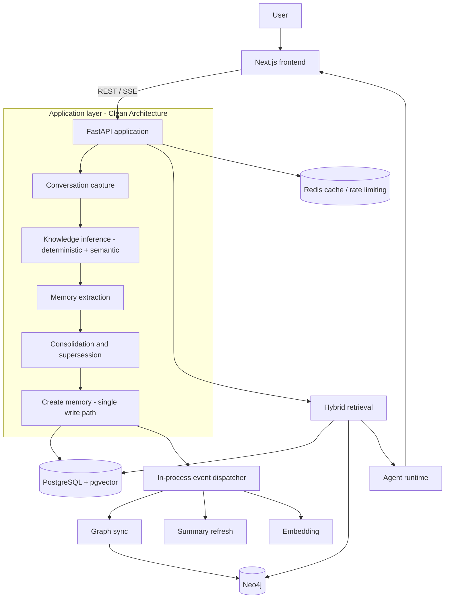
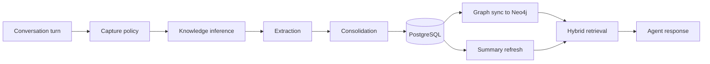

# MemoryArena

An explainable personal memory operating system for AI agents.

MemoryArena ingests natural conversation, infers durable knowledge from it,
stores that knowledge as structured and self-evolving memories, and serves it
back through hybrid retrieval, a knowledge graph, and token-budgeted context
assembly. Every memory carries an append-only evidence trail, so the system can
explain why it believes something, when it first learned it, and how its
confidence changed over time.

---

## Overview

Large language models are stateless. Each request is answered from the prompt
alone, so an agent forgets everything the moment a conversation ends. The common
workaround — replaying raw chat history — does not scale: transcripts grow
without bound, bury durable facts in conversational noise, contradict themselves
over time, and offer no way to explain why a model "remembers" something.

MemoryArena takes a different approach. Instead of storing conversations, it
extracts the durable knowledge inside them and discards the rest. A question
such as "What is Rust?" is never stored verbatim; it is inferred as an interest
("Interested in Rust"). As the same topic recurs across conversations, the
memory evolves — from interest, to learning, to active use, to expertise — and
the prior states remain visible as history rather than being overwritten.

Each memory is more than a string. It has a type, an importance and confidence
score, a status, a position in a knowledge graph, and an evidence record
describing how it came to exist. When two memories conflict — for example, a
stated preference for Rust followed by a switch to Go — a consolidation pass
resolves the contradiction, archives the superseded memory, and records the
supersession rather than silently deleting the old belief.

Retrieval combines lexical and vector search with graph expansion, so a query
returns not only directly matching memories but also related ones reachable
through the graph. The agent answers from that retrieved context and reports the
exact memories, summaries, and graph nodes it used, with no fabricated
citations.

The result is a memory layer that is durable, self-correcting, and
explainable — closer to a personal knowledge base than to a chat log.

---

## Key Features

### Memory intelligence

- Knowledge inference that converts natural language into structured memory
  candidates (deterministic rules with an LLM-backed semantic layer and an
  automatic fallback between them).
- LLM-driven memory extraction with a deterministic offline default, so the
  pipeline runs without external API keys.
- Consolidation that detects duplicates, contradictions, and supersession.
- Reinforcement that strengthens recurring memories instead of duplicating them.
- Memory evolution across interest, learning, usage, and expertise stages.

### Explainability

- Append-only evidence per memory: first seen, last seen, evidence count,
  reinforcement count, and full confidence, importance, reason, topic, and
  progression histories.
- Confidence and importance evolution rendered from real stored history.
- Source attribution on every agent answer, grouped by retrieval provenance.
- Memory lifecycle and lineage derived from status transitions and graph edges.

### Knowledge graph

- Neo4j-backed graph of memories and typed relationships.
- Relationship traversal and neighbor inspection.
- Hybrid retrieval that fuses lexical, vector, and graph-expanded results.

### User experience

- Dashboard with memory health, knowledge categories, and recent activity.
- Timeline of memory evolution grouped by month with event filters.
- Memory Explorer with type and status filters and a detailed inspector.
- Agent Playground with a streamed execution trace and collapsible sources.
- Context Playground and Summary Explorer.

---

## Architecture



The backend follows a clean, layered architecture. The domain layer holds
entities and value objects with no framework dependencies. The application layer
contains use cases, services, and ports. The infrastructure layer provides
adapters for PostgreSQL, Neo4j, Redis, embeddings, and LLM providers. The
delivery layer is a FastAPI application. Side effects (embedding, graph sync,
summary refresh) are driven by domain events through an in-process dispatcher,
so the write path stays single and consistent.

---

## Memory Lifecycle



1. **Capture** — a lightweight policy drops greetings, acknowledgements, and
   non-durable chatter before any expensive work.
2. **Inference** — durable knowledge is inferred from the turn (for example, a
   question about a technology becomes an interest). Raw questions are never
   stored.
3. **Extraction** — the inference candidate is segmented, typed, and scored for
   importance and confidence.
4. **Consolidation** — new memories are compared against existing ones to
   reinforce, supersede, or resolve contradictions.
5. **Storage** — memories are written through a single use case to PostgreSQL.
6. **Graph sync** — memory nodes and typed relationships are synced to Neo4j via
   post-commit events.
7. **Summaries** — rolling per-scope summaries are refreshed.
8. **Retrieval** — queries fuse lexical, vector, and graph-expanded results.
9. **Agent response** — the agent answers from retrieved context and reports its
   sources.

---

## Evidence Engine

Every inferred memory carries an evidence record stored in the memory's JSON
metadata. The record is append-only: new observations are added, and prior
history is never overwritten or deleted.

It tracks:

- `first_seen` and `last_seen` timestamps.
- `evidence_count` and `reinforcement_count`.
- `confidence_history` and `importance_history` — the full series of values.
- `reason_history`, `topic_history`, and `progression_history`.
- `source_type` — whether the observation came from the semantic or
  deterministic inference path.

When a memory is reinforced, the engine appends the current confidence and
importance, increments the counters, and updates `last_seen`, while leaving
`first_seen` and all earlier history intact. This makes a memory's evolution
auditable: the system can show that confidence rose across specific
observations, name the reasons recorded at each step, and report the current
evolution stage — all from stored data rather than recomputed guesses.

The evidence model deliberately lives in the existing metadata column, so it
requires no schema migration and memories created before it degrade gracefully
to an empty history.

---

## Explainability

MemoryArena exposes the reasoning behind its memory rather than treating it as a
black box.

- **Memory Insights** — the inspector shows current confidence and importance,
  confidence and importance evolution as sparklines, the progression stages a
  memory has passed through, the recorded reasons, related graph nodes, and
  summary membership.
- **Timeline** — memory creation, updates, supersessions, and summary refreshes
  grouped chronologically.
- **Source attribution** — every agent answer lists the memories it retrieved,
  grouped by provenance (direct retrieval versus graph expansion), each with its
  retrieval score. Citations reflect what was actually retrieved.
- **Graph relationships** — the inspector and Graph Explorer surface a memory's
  neighbors and typed edges, including contradiction and supersession links.

When evidence is unavailable for a memory, the UI shows an explicit empty state
rather than fabricated values.

---

## Technology Stack

| Layer            | Technology                          |
| ---------------- | ----------------------------------- |
| Backend          | FastAPI                             |
| Language         | Python 3.12+                        |
| ORM              | SQLAlchemy 2 (async)                |
| Validation       | Pydantic 2 / pydantic-settings      |
| Relational store | PostgreSQL 16 with pgvector         |
| Knowledge graph  | Neo4j 5 (with APOC)                 |
| Cache / limiting | Redis 7                             |
| Migrations       | Alembic                             |
| Workflow engine  | Sequential by default; LangGraph optional |
| Frontend         | Next.js 15 (App Router)             |
| UI               | React 19, Tailwind CSS              |
| Frontend types   | TypeScript                          |
| Data fetching    | TanStack Query                      |
| Graph layout     | dagre                               |
| Testing          | Pytest, TypeScript build checks     |
| Containerization | Docker, Docker Compose              |

---

## Repository Structure

```
.
├── backend/                 FastAPI application (clean architecture)
│   ├── app/
│   │   ├── api/             HTTP routes and request/response schemas
│   │   ├── application/     Use cases, services, ports, DTOs
│   │   ├── domain/          Entities and value objects (framework-free)
│   │   ├── infrastructure/  PostgreSQL, Neo4j, Redis, LLM, embeddings
│   │   ├── core/            Configuration and cross-cutting concerns
│   │   └── main.py          Application wiring and lifespan
│   ├── tests/               Unit and integration tests
│   └── pyproject.toml
├── frontend/                Next.js application
│   └── src/
│       ├── app/             Routes (dashboard, timeline, memories, graph, agent, ...)
│       ├── components/      UI and feature components
│       ├── hooks/           TanStack Query hooks
│       ├── services/        API clients
│       └── types/           Shared TypeScript types
├── infrastructure/          Docker init scripts and infra assets
├── docs/                    Project documentation
├── docker-compose.yml       Local PostgreSQL, Neo4j, and Redis
├── render.yaml              Render deployment definition
└── LICENSE                  MIT
```

---

## Getting Started

### Prerequisites

- Python 3.12+
- Node.js 20+
- Docker and Docker Compose (for PostgreSQL, Neo4j, and Redis)

### 1. Start infrastructure

```bash
docker compose up -d postgres neo4j redis
```

This starts PostgreSQL with pgvector, Neo4j with APOC, and Redis. Default
credentials are defined in `docker-compose.yml` and can be overridden with
environment variables.

### 2. Backend

```bash
cd backend
python -m venv .venv && source .venv/bin/activate   # Windows: .venv\Scripts\activate
pip install -e .
alembic upgrade head
uvicorn app.main:app --reload
```

The API is then available at `http://localhost:8000` and interactive docs at
`http://localhost:8000/docs`.

### 3. Frontend

```bash
cd frontend
npm install
npm run dev
```

The application runs at `http://localhost:3000`.

### Environment variables

The backend reads configuration from the environment (database URLs, Neo4j and
Redis connection details, and the LLM provider selection). The LLM and embedding
providers default to deterministic offline implementations, so the full pipeline
runs without external API keys. The frontend reads
`NEXT_PUBLIC_API_BASE_URL` (default `http://localhost:8000/api/v1`) and
`NEXT_PUBLIC_DEFAULT_USER_ID`.

### Commands

```bash
# Backend
pytest                       # run the test suite
alembic upgrade head         # apply migrations

# Frontend
npm run dev                  # development server
npm run typecheck            # TypeScript type checking
npm run build                # production build
```

---

## API Overview

The HTTP API is served under `/api/v1`. The main route groups are:

- **Memory** — create, read, search, update, reinforce, and inspect memories,
  plus analytics and health.
- **Ingest** — submit raw text or conversation turns for inference and
  extraction.
- **Query** — agent queries, including a streamed (SSE) variant that emits the
  execution trace and citations.
- **Graph** — memory-centric graph views, neighbor traversal, and a
  per-user overview.
- **Summaries** — rolling per-scope memory summaries.
- **Retrieval** — hybrid retrieval and retrieval debugging.
- **Context** — token-budgeted context assembly.
- **Auth, health, intelligence, observability** — authentication, readiness and
  liveness probes, maintenance operations, and metrics.

Interactive OpenAPI documentation is available at `/docs`.

---

## Screenshots

> Placeholders — replace with captured images under `docs/screenshots/`.

| View | Image |
| ---- | ----- |
| Landing page | `` |
| Dashboard | `` |
| Timeline | `` |
| Memory Explorer | `` |
| Agent Playground | `` |
| Knowledge Graph | `` |
| Memory Evolution | `` |

---

## Project Highlights

- **Inferred, not transcribed memory.** Durable knowledge is extracted from
  conversation; raw questions and chatter are not stored.
- **Append-only evidence.** Every memory keeps an auditable history of how its
  confidence and importance evolved and why.
- **Self-correcting state.** Consolidation reinforces, supersedes, and resolves
  contradictions instead of accumulating duplicates.
- **Hybrid retrieval with a knowledge graph.** Lexical and vector search are
  fused with graph expansion.
- **Explainable answers.** Agent responses report the exact memories, summaries,
  and graph nodes used.
- **Runs offline by default.** Deterministic LLM and embedding implementations
  let the entire system run and be tested without external API keys.

---

## Roadmap

### Completed

- Memory extraction, consolidation, supersession, and reinforcement.
- Deterministic and semantic knowledge inference with automatic fallback.
- Append-only evidence engine and reinforcement-to-evidence wiring.
- PostgreSQL + pgvector storage and Neo4j graph synchronization.
- Hybrid retrieval, summaries, and token-budgeted context assembly.
- Frontend: dashboard, timeline, memory explorer with insights, agent
  playground with source attribution, graph and summary explorers.

### In progress

- Read-side surfacing of evidence across timeline, dashboard analytics, and the
  agent's natural-language explanations.
- Memory lineage visualization from graph edges.

### Future

- Container image publishing and continuous deployment.
- Expanded monitoring and dashboards.
- Additional memory types and progression rules.

---

## Performance

- **Asynchronous ingestion.** Conversation capture and inference run off the
  request path, so chat responses are not blocked by memory writes.
- **Best-effort semantic inference.** The semantic layer is timeout-bounded and
  falls back to deterministic inference on any failure, so ingestion never
  hangs on the LLM.
- **Hybrid retrieval.** Lexical, vector, and graph signals are combined to
  improve recall without a separate search service.
- **Append-only evidence.** Evidence updates are in-place dictionary appends
  within the existing transaction, adding no extra round-trips.
- **Caching and rate limiting.** Redis backs response caching and rate-limit
  buckets.

No benchmark numbers are claimed here; performance depends on deployment and
provider configuration.

---

## Testing

- **Backend unit tests** cover inference, evidence accumulation, consolidation,
  scoring, and service logic, and run without external services.
- **Integration tests** exercise the persistence, graph, retrieval, and
  maintenance paths against live PostgreSQL and Neo4j.
- **Frontend validation** uses TypeScript type checking (`npm run typecheck`)
  and a production build (`npm run build`).

```bash
cd backend && pytest          # backend suite
cd frontend && npm run typecheck && npm run build
```

Continuous integration runs on GitHub Actions (`.github/workflows/ci.yml`).

---

## Deployment

- **Local / self-hosted.** `docker-compose.yml` provisions PostgreSQL (with
  pgvector), Neo4j (with APOC), and Redis. The backend and frontend run as
  described in Getting Started.
- **Managed.** `render.yaml` and `backend/Dockerfile.render` define a Render
  deployment, including a one-shot migration step and service startup order.

Production image publishing and a full CD pipeline are planned future work.

---

## Contributing

Contributions are welcome.

1. Fork the repository and create a feature branch.
2. Make your change with tests. Keep the existing architecture: domain logic
   stays framework-free, side effects go through events, and new adapters
   implement existing ports.
3. Run `pytest` for the backend and `npm run typecheck && npm run build` for the
   frontend before opening a pull request.
4. Open a pull request describing the change and its rationale.

Please keep pull requests focused and avoid unrelated refactors.

---

## License

Released under the MIT License. See [LICENSE](LICENSE).

---

## Author

**Jeetain Saini**

- GitHub: [github.com/your-handle](https://github.com/your-handle)
- LinkedIn: [linkedin.com/in/your-handle](https://www.linkedin.com/in/your-handle)
- Portfolio: [your-portfolio-url](https://example.com)

> Replace the placeholders above with your actual profile links before
> publishing.
